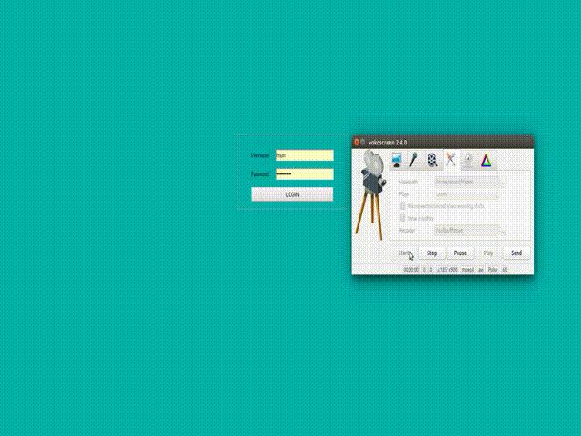

### 项目名称 viewcache
   * Web Memcache Server
   * 正则匹配搜索Key
   * 精确查找key的值

### 依赖条件
   * PHP >= 7.2
   * pecl-memcached >= 3.0.4
   * php -m 可以查看扩展信息
   
### TODO
   * 支持redis
   
### 展示

### 协议
  * The BSC License
  * 见LICENSE.txt
  * 基于MemAdmin开源项目开发，保留MemAdmin原先开源协议

